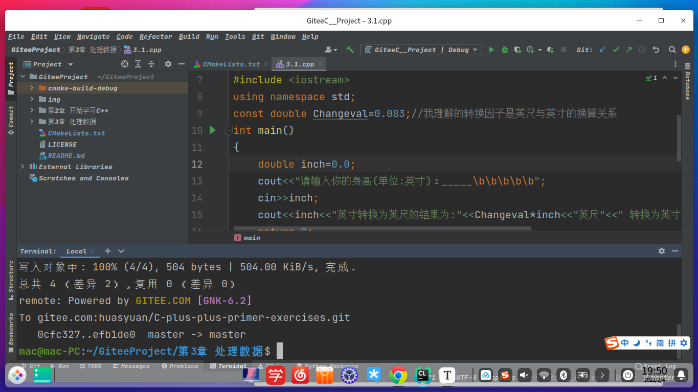
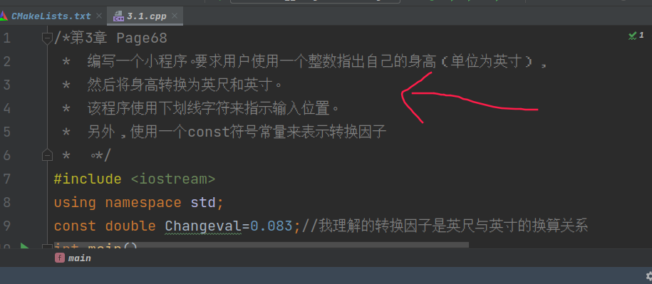
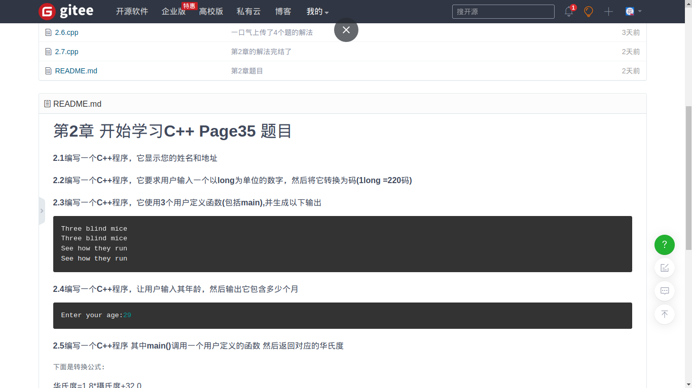

# C++ Primer Plus 单元习题解法项目

### 编写代码时候的运行环境

#### 系统: DeepinOS [点我直达-深度社区](deepin.org/zh/)

#### 软件：Clion2021.3 [点我直达-Cion idea 官网](https://www.jetbrains.com/clion/)

#### C++标准：C++11

#### 

### 开发环境-Clion整体样貌




### 安装Clion前--C++的环境配置

```bash
sudo apt-get install build-essential 
sudo apt-get install libgmp-dev libmpfr-dev libmpc-dev libisl-dev
sudo apt-get install cmake
sudo apt-get install lsb-core
```


### 桌面快捷方式

```bash
[Desktop Entry]
Encoding=UTF-8
Name=Clion  //程序的名称
Exec=sh /home/mac/clion-2021.3/bin/clion.sh//启动程序的脚本
Icon= /home/mac/clion-2021.3/bin/clion.png//程序的图标 在bin文件夹下
Info="Spark"
Terminal=false
Type=Application
StartupNotify=true

```


### 项目说明：

#### 本项目以 C++ primer  plus 这本书的单元名称 作为每个文件夹的名称。

#### 且规定以 （取单元数.题号）作为对应解法的文件名

详细看下面

### 其它规定：

#### 例如：2.1.cpp

```C++
/*第35页 第一题 输出名字和地址*/
#include <iostream>
using namespace std;
int main() {
    cout<<"花思源,中国";
    return 0;
}

```

#### 文件名指出了 它是第2章课后习题的第一题

### 代码内容规定：

#### 第一行 使用多行注释 尽量简述题目对应书本的位置以及  题目大意（对于没书的同学来说）

#### 其它 除第一行为多行注释外 如果 编写过程中 遇到说明注意的地方 我会加以说明的




### 其它：

#### 我没书怎么办？

#### 其实每一个章节文件夹下面，还有README文档，你也是可以先看题目。




### 适合人群：

#### C++初学者，或者一点经验都没有的人（甚至是小学生[至少可以打印“你好，世界“]）

```c++
#include<iostream>
suing namespace std;
int main(){
	cout<<"Hello world!";
	return 0;
}
```


### 推荐的书籍：

### 首选《C++ Primer Plus》Or 《C++ Primer》

#### 提示：网上评论说C++ Primer貌似要好一点。但我选择的C++ primer plus

[C++学习推荐书籍-bilibili](https://www.bilibili.com/video/BV1ob411m76i?from=search&seid=14312083914481170002&spm_id_from=333.337.0.0 )


### 学习编程不止这些：

[必读计算机编程好书推荐！程序员小伙搬出了他的书架！-BILIBILI](https://www.bilibili.com/video/BV1kJ411W7pi?from=search&seid=14312083914481170002&spm_id_from=333.337.0.0)


以上两张图片爬取至哔哩哔哩 Codesheep视频封面

©Codesheep


## 许可协议：

### 第一：

#### 请你遵守CPL3.0协议

### 第二：

#### 最后本项目的源代码文件里的程序题目文字从第三章第一题开始复制粘贴了他人已经写好了 的作品，在此致敬！

#### 作者：jianmo1993

#### 链接：https://www.jianshu.com/p/7ad8c65de0d1

#### 来源：简书

#### 著作权归作者所有。商业转载请联系作者获得授权，非商业转载请注明出处。


### 其它:

#### 关注我：[花思源-哔哩哔哩](https://space.bilibili.com/399313598?from=search&seid=14797274821064358925&spm_id_from=333.337.0.0)

